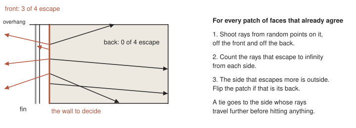

# Outie

Turns every face of a mesh to point out, like an outie, even when the mesh is not closed.

A Python port of libigl's `reorient_facets_raycast`, the reference code for Takayama, Jacobson, Kavan and
Sorkine-Hornung, [A Simple Method for Correcting Facet Orientations in Polygon Meshes Based on Ray Casting](https://jcgt.org/published/0003/04/02/paper.pdf), 2014.

## How



Faces that share edges are gathered into patches first, so a patch is decided as one. Rays are traced by
Embree, through trimesh.

## Use

```python
import outie

polygons = outie.orient(polygons)              # a list of rings, each n by 3
faces = outie.orient_mesh(vertices, faces)     # triangles: vertices n by 3, faces m by 3
```

Both return what they were given, with the faces that pointed in turned round. Underneath are libigl's
own two functions, with its names, arguments and outputs, for callers who need to know which faces moved
or which patch each belongs to:

```python
flip, patch = outie.reorient_facets_raycast(vertices, faces)   # per triangle: turn it? and its patch
faces, patch = outie.bfs_orient(faces)                         # faces wound to agree, and their patches
```

The paper's settings are keyword arguments with libigl's defaults: `rays_total`, `rays_minimum`,
`facet_wise`, `use_parity`, and `seed` so a run repeats. One addition, off by default:
`closed_by_volume` settles a patch that is a closed surface by its signed volume, which is exact, and
shoots rays only for the rest.

## Licence

MPL-2.0, as libigl is: this is a port of its code, taken at libigl commit 7100764. The method is its authors'.
