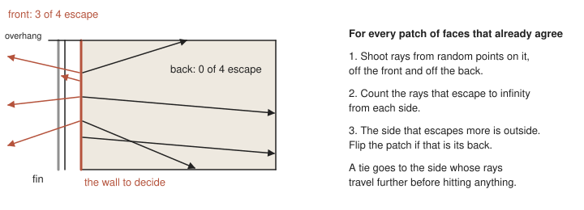

# Outie

Turns every face of a mesh to point out, like an outie, even when the mesh is not closed.

A port of libigl's `reorient_facets_raycast`, written in Rust and used from Python, the reference code for Takayama, Jacobson, Kavan and
Sorkine-Hornung, [A Simple Method for Correcting Facet Orientations in Polygon Meshes Based on Ray Casting](https://jcgt.org/published/0003/04/02/paper.pdf), 2014.

## How



Faces that share edges are gathered into patches first, so a patch is decided as one. Rays are traced in
Rust by parry, in parallel on every core, and numpy arrays pass in without being copied.

## Use

```python
import outie

flip, patch = outie.reorient_facets_raycast(vertices, faces)   # vertices n by 3, faces m by 3 triangles
faces[flip] = faces[flip][:, ::-1]                              # turn the ones that pointed in
```

libigl's function, with its name, arguments and outputs: per triangle, whether to turn it, and the patch it belongs
to. Its settings are keyword arguments with libigl's defaults: `rays_total`, `rays_minimum`, `facet_wise`,
`use_parity`, and `seed` so a run repeats.

One addition: `occluders`, triangles as corners, k by 3 by 3, that rays can hit but that are never turned: the ground a
model stands on, or the things around it. A model with no floor is otherwise as open below as above. The ground belongs
exactly at the model's lowest point, not below it.

Outie takes triangles, as the paper does. Cutting polygons into triangles, mending rings that cross themselves, and
deciding a polygon from its triangles are the caller's.

## Build

The core is Rust, in `src/lib.rs`, bound to Python by PyO3 and built by maturin; `uv sync` builds it, and
`uv run pytest` tests it. Releases are a wheel for each system, so installing needs no Rust.

## Licence

MPL-2.0, as libigl is: this is a port of its code, taken at libigl commit 7100764. The method is its authors'.
