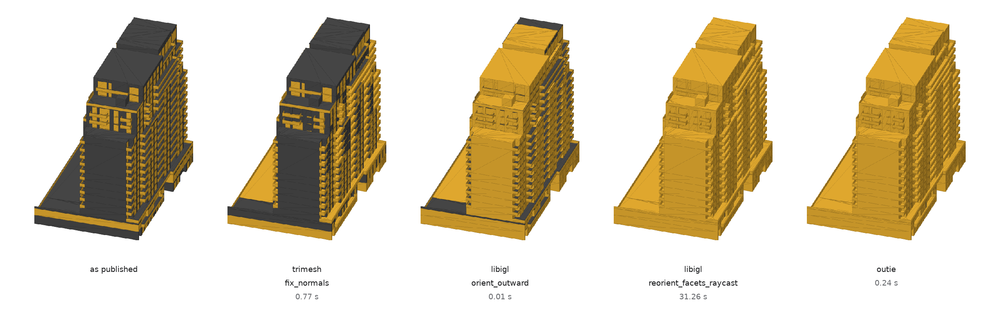
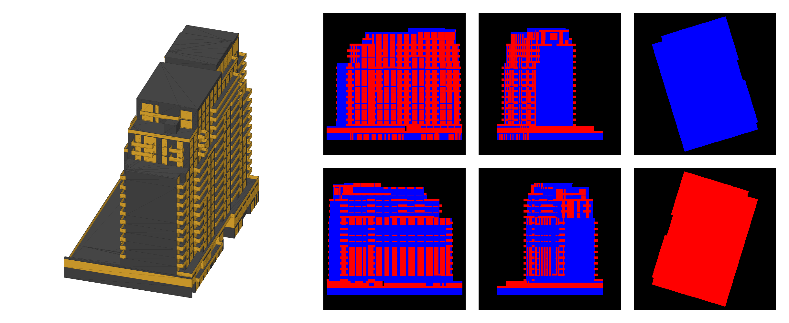
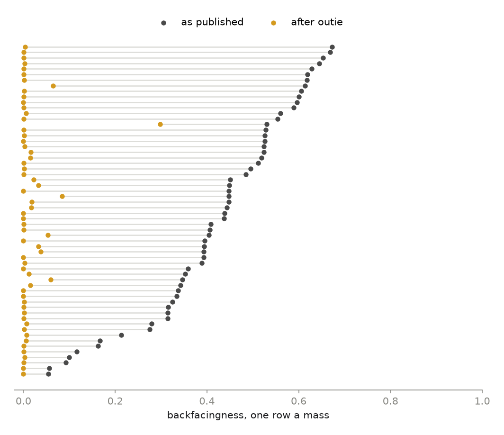
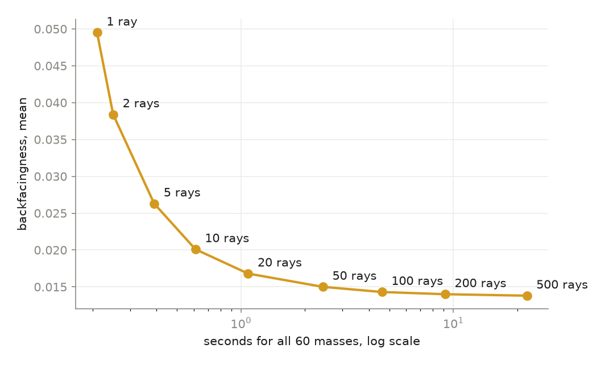
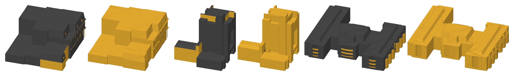
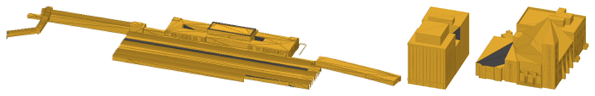
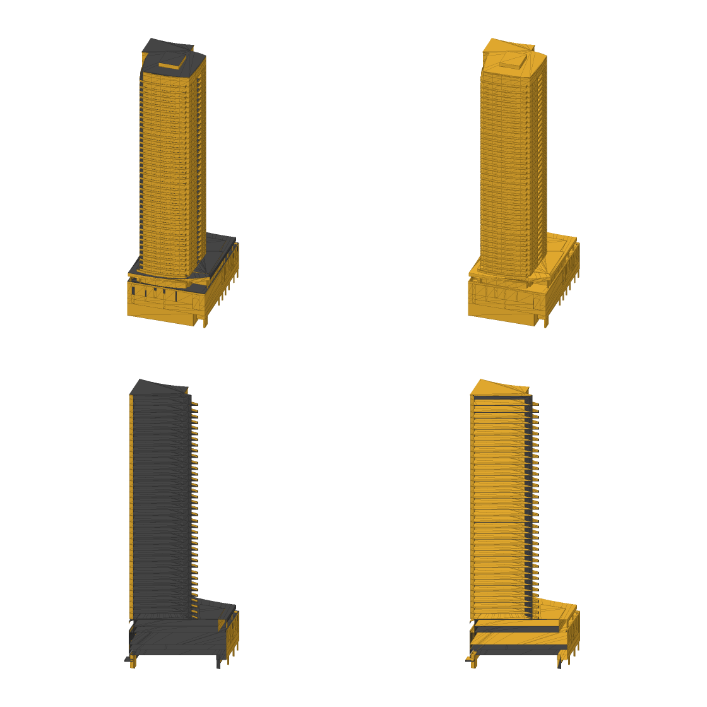
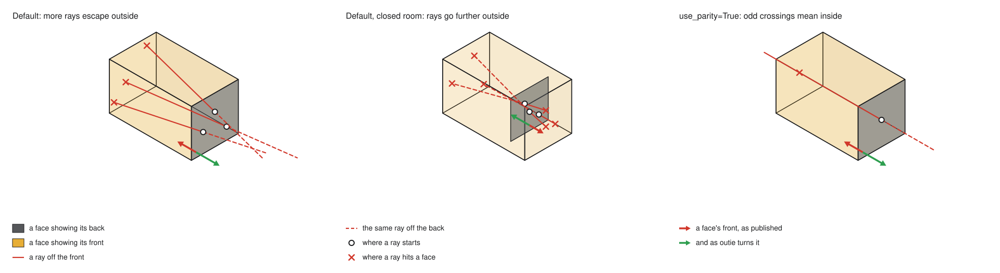
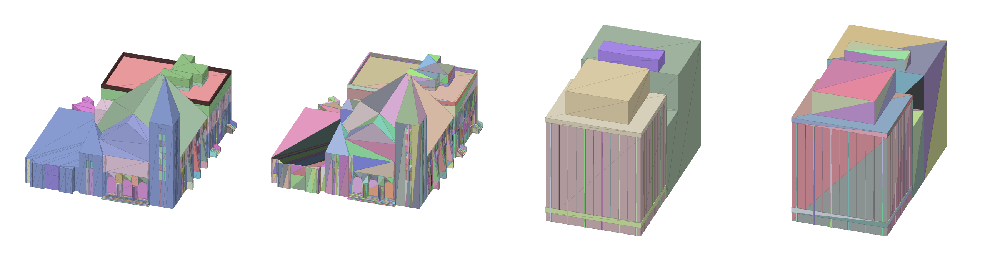

# Outie

Turns each face of a triangle mesh so that it points out, even when the mesh is open.

Outie is the method of [Kenshi Takayama](https://github.com/kenshi84), [Alec Jacobson](https://github.com/alecjacobson), [Ladislav Kavan](https://github.com/ladzin) and [Olga Sorkine-Hornung](https://github.com/sorkine), [A Simple Method for Correcting Facet Orientations in Polygon Meshes Based on Ray Casting](https://jcgt.org/published/0003/04/02/) ([PDF](docs/Takayama2014Orientation.pdf)), 2014, ported from libigl's `reorient_facets_raycast` to Rust, with Embree casting the rays on every core.

All credit goes to them for the method, and to Alec Jacobson and libigl's contributors for the code. Outie only makes it fast to run from Python, with wheels for every system.

It is meant for cities' 3D massing datasets assembled from many people's models, like the City of Toronto's [3D Massing](https://open.toronto.ca/dataset/3d-massing/). They are drawn in Rhino, SketchUp and BIM tools, which hide face orientation by default or don't expose it at all, so faces point whichever way they were left, as in the online model libraries the paper studied. Many are not closed or watertight, so typical repair methods fail.

Turned out quickly, a model needs no two-sided materials, which helps in many ways:

- renderers can cull back faces, drawing half as much;
- light and shadow fall on the side that faces out;
- glTF, 3D Tiles and game engines draw single-sided faces as intended;
- volumes, booleans, exports for printing and energy and daylight analysis read the faces' direction.



*Figure 1. One mass, 29,878 triangles, as published and as each method leaves it, with the time each took.*

| Method | Backfacingness | Time |
|---|---|---|
| As published | 0.5121 | |
| [trimesh](https://github.com/mikedh/trimesh) `fix_normals` | 0.4169 | 0.73 s |
| [libigl](https://github.com/libigl/libigl) `orient_outward` | 0.1991 | 0.01 s |
| libigl `reorient_facets_raycast`, the paper's code | 0.0035 | 30.46 s |
| **outie** | **0.0011** | **0.25 s** |

*Table 1. The methods of Figure 1.*

## Use

```
pip install outie
```

```python
import outie

# vertices: corner positions, n by 3   [[0, 0, 0], [1, 0, 0], [1, 1, 0], ...]
# faces:    triangles, m by 3          [[0, 2, 1], [0, 3, 2], ...]
faces = outie.reorient(vertices, faces)  # the same faces, each turned to point out
```

To know which faces turned, the paper's function gives it per face, with the component each was decided with:

```python
flip, component = outie.reorient_facets_raycast(vertices, faces)  # [False, True, ...], [0, 1, ...]
```

| Option | Default | |
|---|---|---|
| `facet_wise` | `True` | Decide each face alone. `False` decides faces joined by edges together. |
| `use_parity` | `False` | Count the faces each ray crosses instead of whether it escapes. For closed meshes. |
| `rays_total` | 100 a face | Fewer is faster; see Figure 4. |
| `rays_minimum` | `10` | Rays at least for each component. |
| `seed` | `0` | Repeats the random rays. |

```python
outie.measure_backfacingness(vertices, faces)  # the paper's measure: 0 when no face shows its back
```

## Differences from libigl

- **Speed.** libigl's function gathers each component's faces by scanning every face, casts its rays on one thread, and collects every hit along each ray. Outie gathers the faces once, casts on every core, and keeps only the first hit, which is all the vote uses.
- **Names.** `vertices` and `faces` for libigl's `V` and `F`, and component throughout for what the paper, and libigl in places, also call a patch. The options keep libigl's names.
- **Defaults.** `facet_wise=True`, as the paper's results are made; libigl's Python binding defaults to `False`.
- **Input.** Triangles only. Removing duplicate triangles, the paper's `-u`, is the caller's job.

## Results

The data is 60 masses from the City of Toronto's [3D Massing](https://open.toronto.ca/dataset/3d-massing/), 318 to 49,118 triangles each, in [`data/`](data/).



*Figure 2. Backfacingness: the share of a mesh, seen from six sides, that shows the backs of faces, blue.*

| 60 masses | Backfacingness | Time |
|---|---|---|
| As published | 0.4233 ± 0.1590 | |
| **outie** | **0.0140 ± 0.0409** | **5.0 s** |
| `facet_wise=False` | 0.0233 ± 0.0528 | 5.5 s |
| `use_parity=True` | 0.0426 ± 0.0489 | 26.4 s |

*Table 2. Apple M1 Max, 10 cores. `use_parity=True` is slower because each ray counts every face it passes, not just the first it hits.*



*Figure 3. Every mass, as published and after outie. The few left high are mostly floorless masses: the view from beneath sees into them whichever way their faces turn. Seen from above, the worst, at 0.30, falls to 0.07, and the next four to under 0.05.*



*Figure 4. Rays a face against backfacingness and time, all 60 masses, with `rays_minimum=1` so each setting's count is what it says.*



*Figure 5. The three masses outie improves most.*



*Figure 6. The three masses outie leaves worst: mostly thin, single-sided parts, where neither way round is better.*



*Figure 7. The largest mass, as published and after, whole above and cut open below: faces left inside a model are turned too, though not all of them correctly.*

## Method



*Figure 8. How the default and `use_parity=True` decide. `facet_wise=False` is Figure 9.*



*Figure 9. `facet_wise=False`, left of each pair, against the default, right. As the paper found, how well joined faces vote together depends on how a model was built: the first building is joined badly, so one vote turns whole wrong groups, and deciding each face alone is better; the second is built cleanly, so joining works.*

## Acknowledgements

- Kenshi Takayama, Alec Jacobson, Ladislav Kavan and Olga Sorkine-Hornung, for the method and its code.
- [libigl](https://github.com/libigl/libigl), whose code outie ports.
- [Embree](https://github.com/RenderKit/embree), which casts the rays.
- The City of Toronto. Contains information licensed under the Open Government Licence - Toronto.

## Citation

```bibtex
@article{Takayama2014Orientation,
  author  = {Kenshi Takayama and Alec Jacobson and Ladislav Kavan and Olga Sorkine-Hornung},
  title   = {A Simple Method for Correcting Facet Orientations in Polygon Meshes Based on Ray Casting},
  journal = {Journal of Computer Graphics Techniques (JCGT)},
  volume  = {3},
  number  = {4},
  pages   = {53--63},
  year    = {2014}
}
```

## Licence

MPL-2.0, as libigl's. The wheels carry Embree, under Apache-2.0, [LICENSE-EMBREE](LICENSE-EMBREE). The paper is under CC BY-ND 3.0, the data under the Open Government Licence - Toronto.
